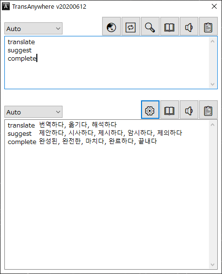

TransAnywhere by Song
=====================
Translates, Suggests and completes words as you type! Translate faster and more efficiently anywhere.

TransAnywhere uses Naver Eng/Kor Dictionary, Daum Eng/Kor Dictionary, Daum Jap/Kor Dictionary, Google Translation, Papago Translation. (네이버 영한/한영 사전, 다음 영한 사전, 다음 일한 사전)

Some antivirus recognizes TransAnywhere as a virus, but there is no virus. Add TransAnywhere to the exclusions.

Using
-----

### AutoComplete

1. Extract the archive to a safe location.
2. If you downloaded the binaries, open `TransAnywhere.exe`.
3. If you downloaded the source, make sure you have a recent version of [AutoHotkey](http://www.autohotkey.com/) installed, and run `TransAnywhere.ahk`.
4. Start typing on TransAnywhere. After the first few characters, a suggestion box will appear.
5. Use the `Up` and `Down` arrow keys to select an entry if the currently selected one is not the desired word.
6. Press `Tab` to trigger the completion with the currently selected word.
7. Alternatively, press one of `1`, `2`, ..., `9`, `0` to trigger completion with the 1st, 2nd, ..., 9th, and 10th word, respectively.

### Translation

1. `Alt+W` to display TransAnywhere, `Ctrl+Enter` to start a new line.
2. `Alt+W` long press to copy the text you selected and translate.
3. You can use Papago instead of Google Translation for Eng/Kor with Papago Client Id and Secret.

Advanced
--------

### AutoComplete

Click on the tray icon to bring up the settings dialog. The dialog allows you to configure settings such as the maximum number of results to show at a time and the number of characters to type before showing suggestions.

The dialog also allows you to edit the wordlist by adding or removing words. All settings are saved automatically upon program exit.

The wordlist is contained in `WordList.txt`. Each line represents a word. The list can be edited with a text editor, but ensure the editor supports larger files before doing so! Some may crash or hang upon editing such files.

### Translation

You should set `Your Languages` you are familiar with in order and enjoy with AHK.

License
-------

This program uses [Autocomplete by Uberi](https://github.com/Uberi/Autocomplete), [IME.ahk](https://w.atwiki.jp/eamat/pages/17.html), [AutoHotkey-JSON](https://github.com/cocobelgica/AutoHotkey-JSON)

This program is provided under the 3-clause BSD license. In short, this gives you the right to modify and distribute the program as you please, as long as you make sure the notice below is accessible to the user.

    Copyright (c) 2020, Songbum Bae
    All rights reserved.

    Redistribution and use in source and binary forms, with or without modification, are permitted provided that the following conditions are met:

    1. Redistributions of source code must retain the above copyright notice, this list of conditions and the following disclaimer.
    2. Redistributions in binary form must reproduce the above copyright notice, this list of conditions and the following disclaimer in the documentation and/or other materials provided with the distribution.
    3. Neither the name of the copyright holder nor the names of its contributors may be used to endorse or promote products derived from this software without specific prior written permission.

    THIS SOFTWARE IS PROVIDED BY THE COPYRIGHT HOLDERS AND CONTRIBUTORS "AS IS" AND ANY EXPRESS OR IMPLIED WARRANTIES, INCLUDING, BUT NOT LIMITED TO, THE IMPLIED WARRANTIES OF MERCHANTABILITY AND FITNESS FOR A PARTICULAR PURPOSE ARE DISCLAIMED. IN NO EVENT SHALL THE COPYRIGHT HOLDER OR CONTRIBUTORS BE LIABLE FOR ANY DIRECT, INDIRECT, INCIDENTAL, SPECIAL, EXEMPLARY, OR CONSEQUENTIAL DAMAGES (INCLUDING, BUT NOT LIMITED TO, PROCUREMENT OF SUBSTITUTE GOODS OR SERVICES; LOSS OF USE, DATA, OR PROFITS; OR BUSINESS INTERRUPTION) HOWEVER CAUSED AND ON ANY THEORY OF LIABILITY, WHETHER IN CONTRACT, STRICT LIABILITY, OR TORT (INCLUDING NEGLIGENCE OR OTHERWISE) ARISING IN ANY WAY OUT OF THE USE OF THIS SOFTWARE, EVEN IF ADVISED OF THE POSSIBILITY OF SUCH DAMAGE.
